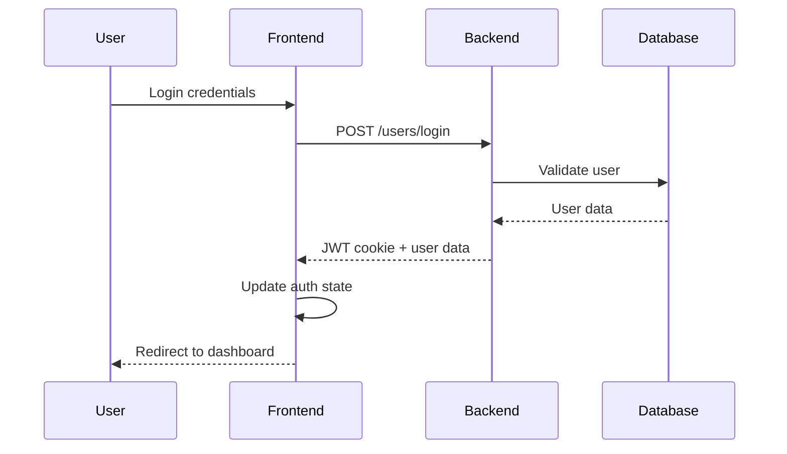
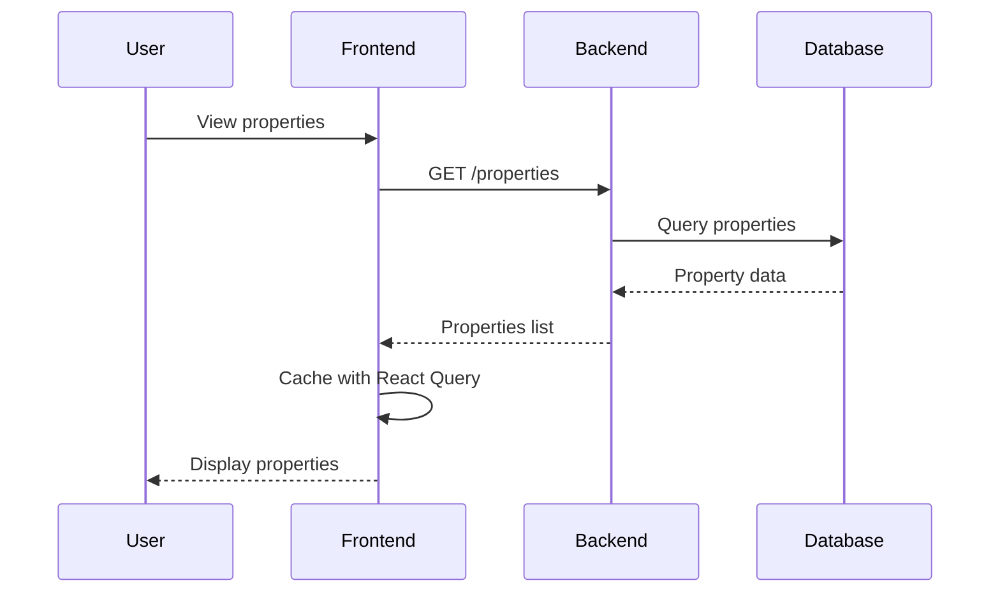

# System Architecture

This document outlines the architectural decisions, patterns, and structure of the Ethio-Home application.

## Overview

Ethio-Home is built as a modern, scalable real estate platform with a clear separation between frontend and backend concerns.

```
┌─────────────────┐    ┌─────────────────┐    ┌─────────────────┐
│   React Frontend │────│   Express API   │────│   MongoDB DB    │
│                 │    │                 │    │                 │
│  - UI Components│    │ - Authentication│    │ - User Data     │
│  - State Mgmt   │    │ - Business Logic│    │ - Properties    │
│  - API Client   │    │ - Data Access   │    │ - Transactions  │
└─────────────────┘    └─────────────────┘    └─────────────────┘
```

## Frontend Architecture

### Technology Stack
- **React 18**: Component-based UI library
- **TypeScript**: Type safety and better developer experience
- **Vite**: Fast development and build tool
- **Tailwind CSS**: Utility-first CSS framework
- **React Router**: Client-side routing
- **Zustand**: Lightweight state management
- **React Query**: Server state management and caching

### Project Structure
```
src/
├── components/          # Reusable UI components
│   ├── auth/           # Authentication components
│   ├── property/       # Property-related components
│   ├── shared/         # Shared/common components
│   └── ui/             # Base UI components (shadcn/ui)
├── hooks/              # Custom React hooks
├── pages/              # Page components (routes)
├── services/           # API service layer
├── store/              # Global state management
├── types/              # TypeScript type definitions
├── utils/              # Utility functions
└── lib/                # Third-party library configurations
```

### Component Architecture

#### Component Hierarchy
```
App
├── Router
│   ├── PublicRoute
│   │   ├── Login
│   │   ├── Signup
│   │   └── Index (Home)
│   └── ProtectedRoute
│       ├── Dashboard
│       ├── Properties
│       ├── PropertyDetail
│       └── Profile
├── Navbar
├── Footer
└── Toaster (Global notifications)
```

#### Component Design Patterns

1. **Atomic Design**
   - Atoms: Button, Input, Card
   - Molecules: SearchBar, PropertyCard
   - Organisms: Navbar, Hero, PropertyList
   - Templates: Page layouts
   - Pages: Complete pages

2. **Container/Presentation Pattern**
   ```typescript
   // Container Component
   const PropertiesContainer = () => {
     const { data, isLoading } = useProperties();
     return <PropertiesList properties={data} loading={isLoading} />;
   };

   // Presentation Component
   const PropertiesList = ({ properties, loading }) => {
     if (loading) return <Skeleton />;
     return properties.map(property => <PropertyCard key={property._id} {...property} />);
   };
   ```

### State Management Strategy

#### Local State (useState/useReducer)
- Component-specific state
- Form state
- UI state (modals, dropdowns)

#### Global State (Zustand)
```typescript
// src/store/authStore.ts
interface AuthState {
  user: User | null;
  isAuthenticated: boolean;
  login: (user: User) => void;
  logout: () => void;
}
```

#### Server State (React Query)
```typescript
// src/hooks/useProperties.ts
export const useProperties = (filters?: PropertyFilters) => {
  return useQuery({
    queryKey: ['properties', filters],
    queryFn: () => propertyService.getProperties(filters),
    staleTime: 5 * 60 * 1000, // 5 minutes
  });
};
```

### API Layer Architecture

#### Service Layer Pattern
```typescript
// src/services/propertyService.ts
class PropertyService {
  async getProperties(filters?: PropertyFilters): Promise<Property[]> {
    const response = await api.get('/properties', { params: filters });
    return response.data.data.properties;
  }

  async createProperty(data: CreatePropertyData): Promise<Property> {
    const response = await api.post('/properties', data);
    return response.data.data.property;
  }
}

export default new PropertyService();
```

#### HTTP Client Configuration
```typescript
// src/services/api.ts
const api = axios.create({
  baseURL: import.meta.env.VITE_API_BASE_URL,
  withCredentials: true,
  timeout: 10000,
});

// Interceptors for auth and error handling
api.interceptors.response.use(
  response => response,
  error => {
    // Global error handling
    if (error.response?.status === 401) {
      // Handle unauthorized
    }
    return Promise.reject(error);
  }
);
```

## Backend Architecture

### Technology Stack
- **Node.js**: JavaScript runtime
- **Express.js**: Web application framework
- **MongoDB**: NoSQL database
- **Mongoose**: ODM for MongoDB
- **JWT**: Authentication tokens
- **Multer**: File upload handling
- **Nodemailer**: Email functionality

### API Design Patterns

#### RESTful API Structure
```
/api/v1/
├── users/              # User management
├── properties/         # Property CRUD
├── interest/           # Interest forms
├── reviews/            # Property reviews
├── selling/            # Transaction handling
└── subscription/       # Subscription management
```

#### Controller Pattern
```javascript
// controllers/propertyController.js
exports.getAllProperties = catchAsync(async (req, res, next) => {
  const features = new APIFeatures(Property.find(), req.query)
    .filter()
    .sort()
    .limitFields()
    .paginate();
    
  const properties = await features.query;
  
  res.status(200).json({
    status: 'success',
    results: properties.length,
    data: { properties }
  });
});
```

#### Model Layer (Mongoose)
```javascript
// models/propertyModel.js
const propertySchema = new mongoose.Schema({
  title: { type: String, required: true },
  description: { type: String, required: true },
  price: { type: Number, required: true },
  location: { type: String, required: true },
  owner: { type: mongoose.Schema.ObjectId, ref: 'User' },
  images: [String],
  isVerified: { type: Boolean, default: false },
  createdAt: { type: Date, default: Date.now }
});
```

## Data Flow Architecture

### Authentication Flow


### Property Management Flow


## Security Architecture

### Authentication & Authorization
1. **JWT with HTTP-only Cookies**
   - Secure token storage
   - CSRF protection
   - Automatic token refresh

2. **Role-Based Access Control (RBAC)**
   ```typescript
   interface User {
     role: 'buyer' | 'seller' | 'agent' | 'admin' | 'employee';
   }
   
   // Route protection
   const ProtectedRoute = ({ allowedRoles, children }) => {
     const { user } = useAuth();
     if (!allowedRoles.includes(user?.role)) {
       return <Unauthorized />;
     }
     return children;
   };
   ```

### Data Validation
- **Frontend**: React Hook Form with Zod schemas
- **Backend**: Express validators and Mongoose schemas
- **API**: Input sanitization and rate limiting

## Performance Architecture

### Frontend Optimization
1. **Code Splitting**
   ```typescript
   const PropertyDetail = lazy(() => import('./pages/PropertyDetail'));
   ```

2. **Image Optimization**
   - Lazy loading
   - WebP format support
   - Responsive images

3. **Caching Strategy**
   - React Query for API responses
   - Browser caching for static assets
   - Service Worker for offline support

### Backend Optimization
1. **Database Indexing**
   ```javascript
   propertySchema.index({ location: 1, price: 1 });
   propertySchema.index({ owner: 1 });
   ```

2. **API Response Optimization**
   - Pagination
   - Field selection
   - Response compression

## Scalability Considerations

### Horizontal Scaling
- Stateless API design
- Load balancer support
- Database connection pooling

### Vertical Scaling
- Efficient queries
- Memory management
- Resource monitoring

### Microservices Transition
Future considerations for breaking down into:
- Authentication service
- Property service
- Payment service
- Notification service

## Error Handling Architecture

### Frontend Error Boundaries
```typescript
class ErrorBoundary extends Component {
  componentDidCatch(error, errorInfo) {
    console.error('Error caught by boundary:', error, errorInfo);
  }
  
  render() {
    if (this.state.hasError) {
      return <ErrorFallback />;
    }
    return this.props.children;
  }
}
```

### Backend Error Handling
```javascript
// Global error handler
app.use((err, req, res, next) => {
  err.statusCode = err.statusCode || 500;
  err.status = err.status || 'error';
  
  if (process.env.NODE_ENV === 'development') {
    sendErrorDev(err, res);
  } else {
    sendErrorProd(err, res);
  }
});
```

## Testing Architecture

### Frontend Testing
- **Unit Tests**: Jest + React Testing Library
- **Integration Tests**: API mocking with MSW
- **E2E Tests**: Playwright or Cypress

### Backend Testing
- **Unit Tests**: Jest + Supertest
- **Integration Tests**: Test database
- **API Tests**: Postman/Newman

## Deployment Architecture

### Development Environment
```
Frontend (Vite) → localhost:5173
Backend (Express) → localhost:3000
Database (MongoDB) → localhost:27017
```

### Production Environment
```
Frontend (Static) → CDN/Nginx
Backend (Express) → Docker Container
Database (MongoDB) → MongoDB Atlas/Self-hosted
Load Balancer → Multiple backend instances
```

## Monitoring & Observability

### Frontend Monitoring
- Error tracking (Sentry)
- Performance monitoring
- User analytics

### Backend Monitoring
- Application logs
- Performance metrics
- Health checks
- Database monitoring

## Future Architecture Considerations

1. **Progressive Web App (PWA)**
   - Service workers
   - Offline functionality
   - Push notifications

2. **Real-time Features**
   - WebSocket integration
   - Live property updates
   - Chat functionality

3. **Mobile Application**
   - React Native implementation
   - Shared business logic
   - Platform-specific optimizations

4. **Advanced Search**
   - Elasticsearch integration
   - Geospatial queries
   - AI-powered recommendations